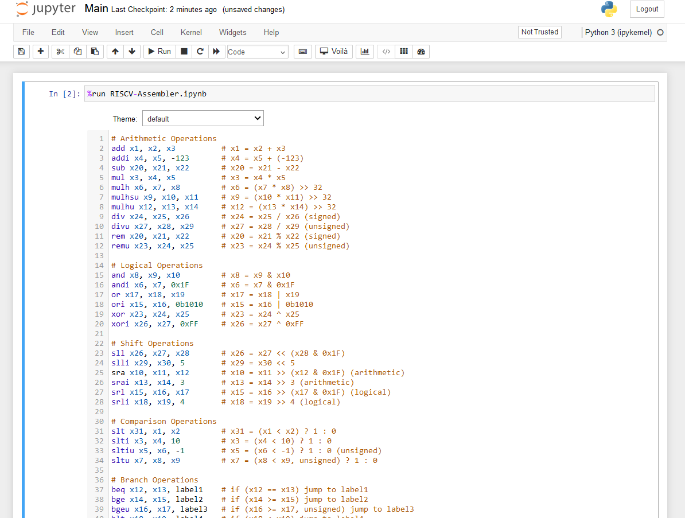
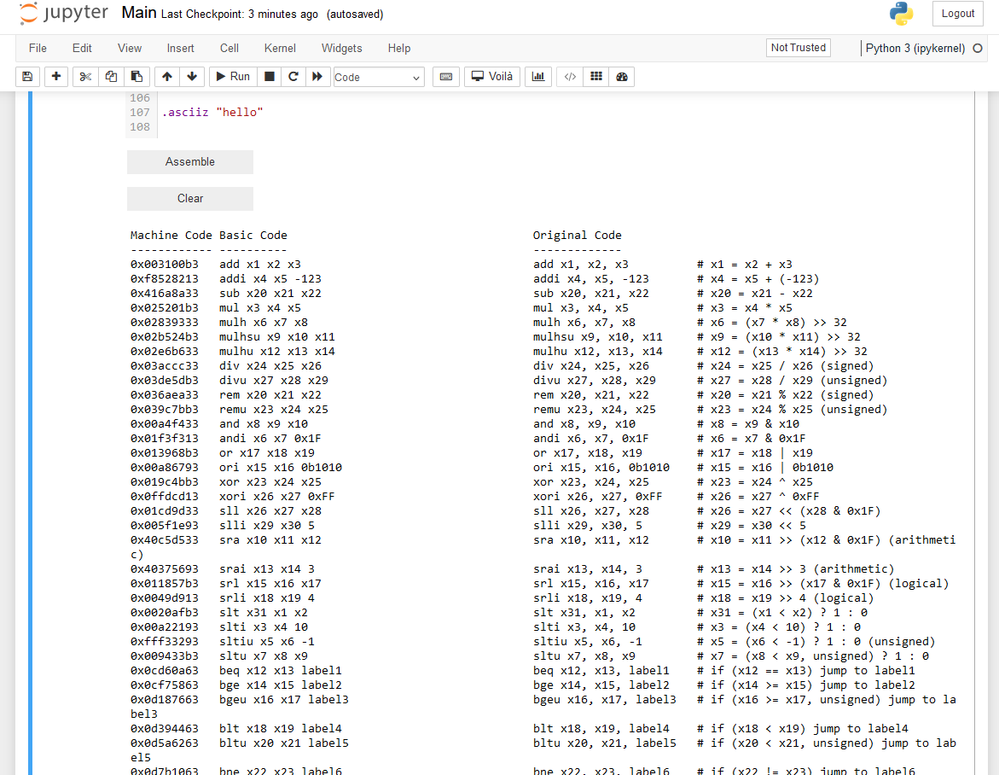

  

  

# Pluto: A RISC-V Assembler for Jupyter and PYNQ
## Overview

**Pluto** is a RISC-V assembler developed to run directly within a Jupyter Notebook environment

## Getting Started

1. Place the files [Main.ipynb](https://github.com/Logicademy/Pluto/blob/main/Main.ipynb) and [RISCV-Assembler.ipynb](https://github.com/Logicademy/Pluto/blob/main/RISCV-Assembler.ipynb) in the same directory within your Jupyter Notebook environment.
   - **Optional**: Upload the [themes](https://github.com/Logicademy/Pluto/tree/main/themes) directory
   
2. Open and run [Main.ipynb](https://github.com/Logicademy/Pluto/blob/main/Main.ipynb). This file serves as the main interface, providing an interactive code editor for writing and assembling RISC-V assembly code.

3. The code editor in `Main.ipynb` includes:
   - **RISC-V Syntax Highlighting**: Highlighting for instructions, labels, registers, directives, and immediate values.
   - **Error Messaging**: Error messages to help debug and correct syntax or semantic issues.
   - **Theme Customization**: Multiple dark and light editor themes are available.

Some sample [RISC-V assembly projects](https://github.com/Logicademy/Pluto/tree/main/sample%20projects) are provided

## Supported Instructions

### Core Instructions
The assembler supports the core RISC-V instruction set, including:

- **I-type**: `addi`, `slti`, `sltiu`, `xori`, `ori`, `andi`, `lb`, `lh`, `lw`, `lbu`, `lhu`
- **R-type**: `add`, `sub`, `sll`, `slt`, `sltu`, `xor`, `srl`, `sra`, `or`, `and`
- **B-type**: `beq`, `bne`, `blt`, `bge`, `bltu`, `bgeu`
- **S-type**: `sb`, `sh`, `sw`
- **U-type**: `lui`, `auipc`
- **J-type**: `jal`, `jalr`

**Note:** The `ebreak`, `fence`, `fence.i`, and cycle counter instructions are not currently supported in this assembler.

### Pseudo-Instructions

The assembler expands pseudo-instructions into one or more core instructions.

- **Control Flow Instructions**: `beqz`, `bgez`, `bgt`, `bgtu`, `bgtz`, `ble`, `bleu`, `blez`, `bltz`, `bnez`, `j`, `jal`, `jalr`, `jr`
- **Comparison Instructions**: `seq`, `seqz`, `sge`, `sgt`, `sgtz`, `sle`, `sltz`, `sne`, `snez`
- **Data Manipulation Instructions**: `li`, `mv`, `neg`, `nop`, `not`, `lw`, `sw`, `tail`
- **Function Call Instructions**: `call`, `ret`

## Immediate Values

In RISC-V assembly, immediate values are numeric constants within instructions. These immediate values can be specified in decimal, binary (`0b`), or hexadecimal (`0x`) formats. You can also optionally indicate the sign with a `+` or `-` sign.

## Register Conventions

RISC-V has 32 general-purpose registers.

| Register | Name | Description                     |
|----------|------|---------------------------------|
| x0       | zero | Constant 0                      |
| x1       | ra   | Return address                  |
| x2       | sp   | Stack pointer                   |
| x3       | gp   | Global pointer                  |
| x4       | tp   | Thread pointer                  |
| x5-x7    | t0-t2| Temporary (caller-saved)        |
| x8       | s0/fp| Saved/frame pointer             |
| x9       | s1   | Saved                           |
| x10-x17  | a0-a7| Argument registers              |
| x18-x27  | s2-s11| Saved (callee-saved)           |
| x28-x31  | t3-t6| Temporary (caller-saved)        |

## Supported Directives

Directives help define sections, variables, and data in an assembly program:

- **`.text` / `.data`**: Switch between code and data segments.
- **`.byte`**: Allocates a byte in memory.
- **`.word`**: Allocates a 4-byte word in memory.
- **`.asciiz`**: Stores a null-terminated string.
- **`.globl`**: Marks a label as global, making it accessible across files.

## Error Handling

The assembler provides error messages with line-specific information to help identify issues, such as label redefinitions, invalid directives, or incorrect instruction formats.

## Pluto in Action

  

  

## License

This project is licensed under the [**GNU Affero General Public License (AGPL) Version 3**](https://github.com/Logicademy/Pluto/blob/main/LICENSE).

## Acknowledgments

This project's design was heavily inspired by the RISC-V assembler [Venus](https://github.com/kvakil/venus), which is licensed under the MIT License.